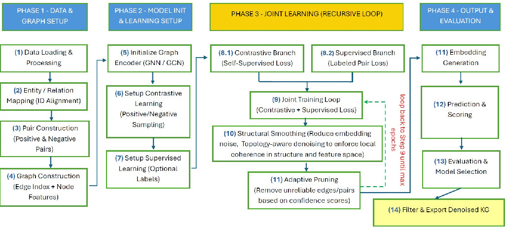

# HYPERION-KG-denoising

This is the anonymized code for IJCAI 2026 submission for the paper "HYPERION: Hybrid Contrastive and Supervised Learning with Adaptive
Refinement for Knowledge-Graph Denoising".

## Abstract
Knowledge graphs used in many applications are often affected by noisy, incomplete, or spurious relations. For example, in biomedical applications, it can significantly degrade downstream tasks such as drug-target and drug-drug interaction prediction. We propose HYPERION, a hybrid framework for large-scale knowledge graph denoising that combines self-supervised contrastive learning with supervised refinement when trusted labels are available. The method jointly exploits structural graph information and semantic node representations, aligning the two views through mutual-information regularization. An adaptive refinement process recursively prunes low-confidence edges and applies structural smoothing during training, progressively stabilizing the graph topology. Extensive experiments on large biomedical benchmarks, including DRKG, demonstrate that HYPERION produces more reliable graph representations and significantly improves ranking-based interaction prediction performance (AUC, AUPR) under rigorous evaluation protocols.



*Figure: Pipeline for Denoised Knowledge Graph Construction and Joint Representation Learning*

## Details

HYPERION is a hybrid denoising pipeline for knowledge graphs that combines:

- Graph neural network (GNN)-based encoding of the KG structure
- Pre-computed knowledge graph embeddings (KGEs) (e.g., using the RotatE model).
- Optional semantic node features (e.g., using TransE, ComplEx, or hyperbolic embedding models).
- Self-supervised and supervised objectives (hybrid, self-supervised-only, or supervised-only)


Experiments are run on the [DRKG](https://github.com/gnn4dr/DRKG) knowledge graph, and two smaller subgraphs.
For each of these three graphs, two embeddings are used: RotatE and TransE.
The knowlegde graph triples and the initial embeddings for both subgraphs can be found in data/ as zip files (one-million.zip and twenty-th.zip respectively).

- twenty-th.zip: Exclusively the \textit{sideeffect} relation.
- one-million.zip: Multiple relation types, including association, interaction, drug-drug, and drug-target.

For the full DRKG, the triples and embeddings can be found at [Google Drive](https://drive.google.com/file/d/1_EVLwYw85Y4IQnecdp9YlnvXz2GSie4_/view?usp=sharing ).

To generate the initial embeddings for the full DRKG, (and how the subgraph embeddings were learned), https://github.com/DeepGraphLearning/KnowledgeGraphEmbedding was used, with a command like:
```bash
python -u run.py --do_train --do_valid --do_test --data_path DRKG --model RotatE -n 256 -b 1024 -d 100 -g 24.0 -a 1.0 -adv -lr 0.0001 --max_steps 150000 -save models/RotatE_DRKG --test_batch_size 16 -de
```

## Requirements
The code has been tested with Python 3.12.12 and the following package versions:
```
numpy==2.3.4
networkx==3.5
scikit-learn==1-7-2
torch==2.9.0
torch-geometric==2.7.0
```

## Running the Pipeline
The code is run using `main.py`, and takes several parameters. Some of these are:
- `--mode`: Training mode: `hybrid`, `selfsupervised`, or `supervised`.
- `--kgpath`: Path to a Hetionet-style TSV file with `head`, `relation`, `tail` columns.
- `--kge`: Path to a `.npy` file with KGE node embeddings.
- `--semantic`: Optional `.npy` file with semantic node features.
- `--epochs`: Number of training epochs to run.
- `--kfold`: Number of folds for cross-validation on supervised pairs (must be >1).
- `--fixed_threshold`: Fixed pruning threshold for denoising (overrides percentile-based pruning).

An example for running the code is:  
```bash
python3 main.py \
--mode hybrid \
--kgpath data/drkg.tsv \
--kge path/to/RotatE/embeddings.npy \
--epochs 50 \
--kfold 2 \
--fixed_threshold 0.7 \
--alpha 0.5 \
--semantic path/to/TransE/embeddings.npy 
```

## DTI and DDI Evaluation

The code extracts positive DTI and DDI pairs using [utils/kg_supervision.py](utils/kg_supervision.py) and then evaluates
link prediction performance of the trained model:
- Metrics include: AUC-ROC, AUC-PR, and F1 score.

These evaluations are performed over the pruned/denoised KG using `HybridDenoiser.evaluate_pairs`.

## Checkpoints and Metrics
- Model checkpoints:
	- `hybrid_fold{fold_id}.pt` for each fold.
- Training metrics:
	- `training_metrics_fold{fold_id}.json` for each fold.

These files can be used to track training dynamics and compare model configurations.
